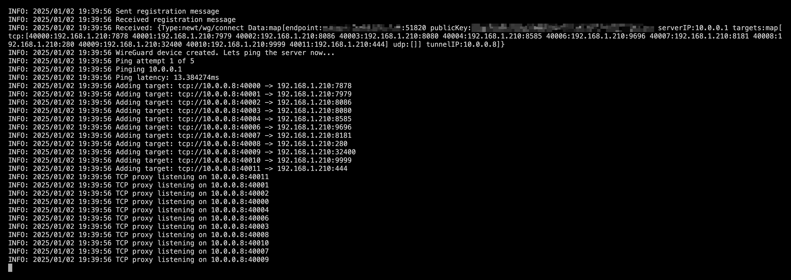

# Newt

Newt is a fully user space [WireGuard](https://www.wireguard.com/) tunnel client and TCP/UDP proxy, designed to securely expose private resources controlled by Pangolin. By using Newt, you don't need to manage complex WireGuard tunnels and NATing to expose your resources.

### Installation and Documentation

Newt is used with Pangolin and Gerbil as part of the larger system. See documentation below:

-   [Installation Instructions](https://docs.fossorial.io)
-   [Full Documentation](https://docs.fossorial.io)

## Preview



_Sample output of a Newt container connected to Pangolin and hosting various resource target proxies._

## Key Functions

### Registers with Pangolin

Using the Newt ID and a secret the client will make HTTP requests to Pangolin to receive a session token. Using that token it will connect to a websocket and maintain that connection. Control messages will be sent over the websocket.

### Receives WireGuard Control Messages

When Newt receives WireGuard control messages, it will use the information encoded (endpoint, public key) to bring up a WireGuard tunnel using [netstack](https://github.com/WireGuard/wireguard-go/blob/master/tun/netstack/examples/http_server.go) fully in user space. It will ping over the tunnel to ensure the peer on the Gerbil side is brought up. 

### Receives Proxy Control Messages

When Newt receives WireGuard control messages, it will use the information encoded to crate local low level TCP and UDP proxies attached to the virtual tunnel in order to relay traffic to programmed targets.

## CLI Args

- `endpoint`: The endpoint where both Gerbil and Pangolin reside in order to connect to the websocket.
- `id`: Newt ID generated by Pangolin to identify the client.
- `secret`: A unique secret (not shared and kept private) used to authenticate the client ID with the websocket in order to receive commands. 
- `dns`: DNS server to use to resolve the endpoint
- `log-level` (optional): The log level to use. Default: INFO

Example:

```bash
./newt --id 31frd0uzbjvp721 --secret h51mmlknrvrwv8s4r1i210azhumt6isgbpyavxodibx1k2d6 --endpoint https://example.com
```

## Build

### Container 

Ensure Docker is installed.

```bash
make
```

### Binary

Make sure to have Go 1.23.1 installed.

```bash
make local
```

## Licensing

Newt is released under the ... license. For inquiries about commercial licensing, please contact us.

## Contributions

Please see [CONTRIBUTIONS](./CONTRIBUTIONS.md) in the repository for guidelines and best practices.